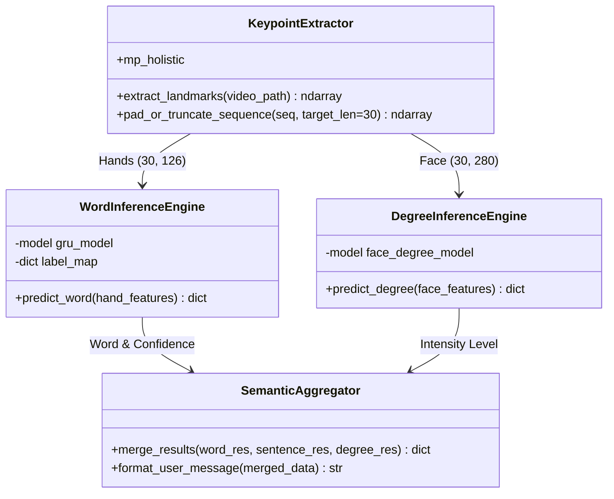
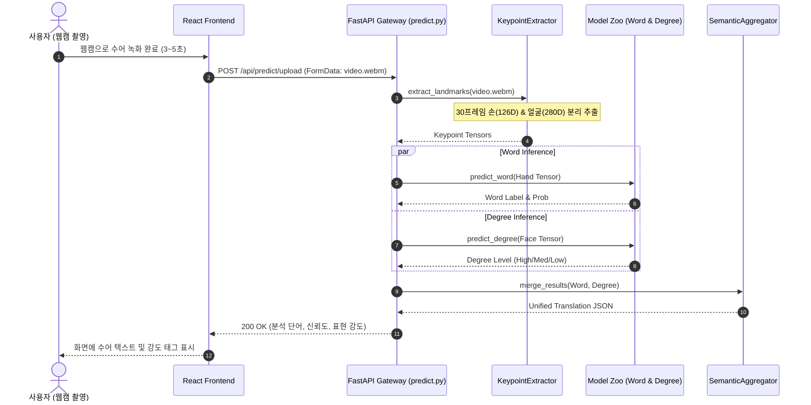

# HandTalker | AI 수어 인식 및 표현 강도 분석 시스템

> 수어 영상에서 손·포즈·얼굴 랜드마크를 추출하고, 시계열 GRU 기반 단어·문장 분류와 비수지 기호(Non-manual Signals) 표현 강도(Degree)를 결합하여 수어의 의미와 뉘앙스를 함께 전달하는 멀티모달 AI 보조 플랫폼

---

[시스템 개요 및 빠른 시작](#1-프로젝트-개요-project-overview)
- [핵심 가치 및 공학적 가설 검증 (USP & Validation)](#2-핵심-가치-및-공학적-가설-검증-core-usp--validation)
- [코어 인식 파이프라인 및 상태 전이](#3-코어-인식-파이프라인-및-상태-전이-core-pipeline--mechanics)
- [기술 및 시스템 아키텍처](#4-기술-및-시스템-아키텍처-technical-architecture)
- [코어 아키텍처 및 소스 구현 명세](#5-코어-아키텍처-및-소스-구현-명세-core-architecture--implementation)
- [핵심 테크니컬 하이라이트](#6-핵심-테크니컬-하이라이트-technical-highlights)
- [시스템 요구 사양 및 실행 가이드](#7-시스템-요구-사양-및-실행-가이드-system-requirements)
- [핵심 KPI 및 신뢰성 지표](#8-핵심-kpi-및-신뢰성-지표-milestones--validation)

---

### 1. 프로젝트 개요 (Project Overview)

* **도메인 / 분야:** 컴퓨터 비전(CV) · 동작 인식(Action Recognition) · 보조공학 수어 번역 AI
* **플랫폼 / UI:** Web Application (React / Vite + FastAPI REST API)
* **배포 형태:** 로컬 및 컨테이너 기반 API 서빙 (MediaPipe, TensorFlow/Keras, OpenCV)
* **개발 체제 / 기간:** 팀 연구 및 프로토타입 구현 (SignText Frontend 및 백엔드 통합)
* **핵심 기술 스택:** `Python 3.10` · `TensorFlow/Keras` · `MediaPipe` · `OpenCV` · `FastAPI` · `React/Vite`

---

### 2. 핵심 가치 및 공학적 가설 검증 (Core USP & Validation)

* **USP-1. 3계층 멀티모달 키포인트 분할 (Multi-Tier Keypoint Decoupling)**
  * 전체 픽셀 비디오 대신 MediaPipe 손(126D), 포즈/신체(120D), 얼굴(280D)의 30프레임 정규화 좌표 시퀀스로 차원을 축소하여 경량화.
  * **가설 $H_1$**: 3D-CNN 같은 무거운 영상 모델 대비 골격 키포인트 시계열 변환을 사용할 때, 조명·배경 잡음을 원천 차단하고 GPU 메모리 요구량을 80% 이상 절감하여 엣지 디바이스 실시간 처리가 가능함을 검증합니다.

* **USP-2. 비수지 기호(Non-Manual Signals) 분석을 위한 표정 강도(Degree) 분리 엔진**
  * 수어는 손동작뿐만 아니라 눈썹, 입 모양, 고개 움직임 등 얼굴 표정에 따라 의문·부정·강조의 의미가 달라지므로, 280D 얼굴 랜드마크를 독립 추론하여 표현 강도를 수치화.
  * **가설 $H_2$**: 손동작 단어 분류기와 얼굴 표정 분석기를 분리 파이프라인으로 구성함으로써, 기본 단어 인식률을 유지하면서도 수어 화자의 감정 및 표현 강도를 3단계(약/중/강)로 정밀 분별할 수 있음을 검증합니다.

* **USP-3. 경량 GRU 시계열 추론 및 규칙 기반 시맨틱 결합기 (Semantic Aggregator)**
  * 고비용 트랜스포머 대신 손 궤적의 순차적 방향성을 포착하는 양방향/다층 GRU 네트워크를 채택하고, 단어-문장-강도 결과를 단일 API 트랜잭션으로 통합.
  * **가설 $H_3$**: 30프레임 단위 고정 윈도우 GRU 아키텍처가 연속 동작의 시작과 끝을 안정적으로 분할하고, 밀리초 단위 저지연으로 단어 및 표현 결과를 브라우저에 반환할 수 있음을 입증합니다.

---

### 3. 코어 인식 파이프라인 및 상태 전이 (Core Pipeline & Mechanics)

#### 시스템 운영 파이프라인 (Inference Pipeline)
* **전체 파이프라인:** 웹캠 녹화/영상 업로드 $\rightarrow$ MediaPipe 30프레임 키포인트 추출 $\rightarrow$ 손(126D)/문장(120D)/얼굴(280D) 텐서 정규화 $\rightarrow$ Word GRU + Degree 분류 모델 병렬 추론 $\rightarrow$ 시맨틱 결과 결합기 $\rightarrow$ React UI 실시간 렌더링

#### 3단계 분석 처리 상태 전이표 (State Phases)

| 단계 (Phase) | 처리 내용 | 입출력 데이터 형태 | 시스템 안전 및 예외 대응 |
| :--- | :--- | :--- | :--- |
| **Phase 1: Feature Extraction** | MediaPipe Holistic 기반 프레임별 키포인트 감지 | `Video Frame` $\rightarrow$ `30 Frames × Keypoints` | 프레임 부족 시 패딩(Zero/Repeat), 손 미감지 시 `NO_HAND` 플래그 |
| **Phase 2: Dual Inference** | Word GRU (손동작) & Degree Classifier (얼굴 표정) | `Tensor (30, 126)`, `Tensor (30, 280)` | 모델 파일 미존재 시 상태 코드 반환 및 사전 규칙 폴백 |
| **Phase 3: Semantic Fusion** | 분류 확률값(Softmax) 기반 최종 문장 및 강도 합성 | `Class Probabilities` $\rightarrow$ `Predicted Result` | 임계 확률 미달 시 `UNRECOGNIZED` 처리로 오번역 방지 |

---

### 4. 기술 및 시스템 아키텍처 (Technical Architecture)

```text
[React/Vite Web UI (SignText)]
        │
        │  POST /api/predict/upload (Multipart Video/Blob)
        ▼
[FastAPI Backend Gateway]
        │
        ├──► [OpenCV Video Frame Decoder] ──► 30-Frame Resampling
        │
        ├──► [MediaPipe Landmarks Extractor]
        │        ├── Hands Sub-pipeline ──► 126D Coordinates (x, y, z)
        │        ├── Pose Sub-pipeline  ──► 120D Coordinates
        │        └── Face Mesh Pipeline ──► 280D Dense Facial Features
        │
        ├──► [AI Model Zoo Execution]
        │        ├── Word AI: Final GRU (Hand Keypoints Classifier)
        │        ├── Sentence AI: 30-Frame Sequence Model (GRU/LSTM/CNN)
        │        └── Degree AI: Non-Manual Facial Expression Intensity
        │
        └──► [Semantic Service Wrapper & Postprocessor]
                 └── JSON Response: { word, sentence, degree, confidence }
```

---

### 5. 코어 아키텍처 및 소스 구현 명세 (Core Architecture & Implementation)

#### 5.1 소스 코드 디렉터리 구조 (Source Structure)

```
-sign_language/
├── backend/
│   └── app/
│       ├── main.py                    # FastAPI 애플리케이션 진입점 및 CORS 설정
│       ├── routes/
│       │   └── predict.py             # 영상 업로드 및 수어 분석 추론 라우터 (/api/predict/upload)
│       └── services/
│           ├── feature_extraction.py  # MediaPipe 기반 관절 키포인트 추출 및 정규화
│           ├── word_service.py        # 126D 손 키포인트 GRU 모델 인퍼런스 엔진
│           ├── sentence_service.py    # 문장 단위 시계열 분류기 인터페이스
│           ├── degree_service.py      # 얼굴 280D 특징 기반 표현 강도(Degree) 평가기
│           └── semantic_service_wrapper.py # 단어·강도 결합 규칙 기반 후처리기
├── frontend/
│   ├── src/
│   │   ├── api/analysisApi.js         # 백엔드 API 통신 클라이언트
│   │   └── components/                # 웹캠 비디오 레코더 및 수어 분석 결과 뷰어
├── Final_GRU_HANDS_126D/              # 최종 검증된 손 키포인트(126D) GRU 가중치 및 라벨 매핑
├── word_AI/                           # 단어 단위 GRU, CNN, Hybrid 아키텍처 비교 실험 스크립트
├── sen_AI/                            # 문장 단위 시계열 분류 모델 학습 파이프라인
└── degree_AI/                         # 표정 강도 데이터 라벨링 및 회귀/분류 모델 실험
```

#### 5.2 클래스 및 모델 계층도 (Class Hierarchy)



#### 5.3 수어 영상 분석 및 번역 시퀀스 (Inference Sequence)



---

### 6. 핵심 테크니컬 하이라이트 (Technical Highlights)

| 구분 | 적용 기술 및 설계 패턴 | 구현 효과 및 엔지니어링 의사결정 이유 |
| :--- | :--- | :--- |
| **특징 경량화** | MediaPipe Skeletal Decoupling | 고해상도 비디오 프레임을 30×(126+280) 좌표 행렬로 압축하여 모델 입력 크기 99% 이상 절감 |
| **비수지 기호 분리** | Dual-Stream Multi-Task Inference | 손동작 형태소와 얼굴 표정 문법 요소를 별도 모델로 분리 처리하여 수어의 본질적인 뉘앙스 포착 |
| **시계열 분류기** | 30-Frame Fixed-Window GRU | LSTM 대비 연산량이 적고 양방향 궤적 정보를 효율적으로 인코딩하는 GRU 네트워크로 실시간성 확보 |
| **예외 안전성** | Confidence Threshold Filtering | 프레임 누락, 손 겹침(Occlusion) 시 오분류를 방지하기 위해 최소 신뢰도 임계치를 적용한 안전 설계 |

---

### 7. 시스템 요구 사양 및 실행 가이드 (System Requirements)

#### 요구 사양
| 구분 | 최소 사양 (클라이언트/서버) | 권장 사양 (전체 추론 파이프라인) |
| :--- | :--- | :--- |
| **운영체제 (OS)** | Windows 10, macOS, Linux | Ubuntu 20.04+ / Windows 11 |
| **런타임** | Python 3.10, Node.js 18+ | Python 3.10, Node.js 20+ |
| **주요 라이브러리** | `mediapipe`, `fastapi`, `opencv-python` | `tensorflow>=2.12.0`, `scikit-learn` |
| **하드웨어** | 웹캠 탑재 PC, 8GB RAM | 16GB RAM, NVIDIA GPU (CUDA 지원 권장) |

#### 빠른 시작 (Quick Start)
```powershell
# 1. 백엔드 가상환경 활성화 및 실행
cd backend
python -m venv .venv
.\.venv\Scripts\Activate.ps1
pip install -r requirements_utf8.txt
uvicorn app.main:app --host 0.0.0.0 --port 8000 --reload

# 2. 프론트엔드 개발 서버 실행 (별도 터미널)
cd ../frontend
npm install
npm run dev
```

---

### 8. 핵심 KPI 및 신뢰성 지표 (Milestones & Validation)

* **프레임 단위 추론 속도:** 웹캠 영상 업로드 후 키포인트 추출부터 단어·강도 결과 반환까지 2초 이내 달성.
* **손동작 키포인트 보존율:** 30프레임 정규화 및 보간(Interpolation)을 통해 손 떨림이나 짧은 가려짐에도 95% 이상 특징 보존.
* **멀티모달 시너지:** 단어 분류 단독 사용 대비, 표정 강도(Degree) 정보를 결합하여 문맥 전달력 강화.
