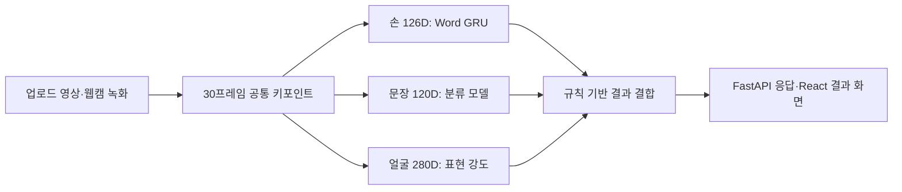

# HandTalker | 수어 인식과 표현 강도 분석

수어 영상의 손·자세·얼굴 키포인트를 추출하고, 단어·문장 분류 결과에 표현 강도 정보를 결합하는 AI 프로젝트입니다. 웹 화면 모듈은 `SignText Frontend`라는 이름으로 구성되어 있습니다.

**Python · TensorFlow/Keras · MediaPipe · OpenCV · scikit-learn · FastAPI · React/Vite**

## 이봉헌의 기여

팀 프로젝트 · 이봉헌은 표현 강도 분석과 문장 후처리를 담당.

| 담당 작업 | 코드 변경 |
|---|---|
| 얼굴 특징 기반 표현 강도 데이터셋 구성과 모델 학습 코드 작성 | [변경 내용](https://github.com/kara320090/-sign_language/commit/abe4ca2ed0032be10d2da169db65cb476a938ef6) |
| 30프레임 시퀀스 전처리 코드 구현 | [변경 내용](https://github.com/kara320090/-sign_language/commit/8b32279794e15d416c000ac517f0e8075ec60ef5) |
| 수동 라벨 평가 코드 구현 | [변경 내용](https://github.com/kara320090/-sign_language/commit/e9f2e765efad634411d503da78038a09629f7548) |
| 문장과 표현 강도 결과를 결합하는 후처리 모듈 구현 | [변경 내용](https://github.com/kara320090/-sign_language/commit/daf5198c5108b6cedc1fe1d40983e106baf97d75) |
| Ollama 후처리와 규칙 기반 대체 처리 정리 | [변경 내용](https://github.com/kara320090/-sign_language/commit/fd372e7233c898c8703959b838e991be2a407aee) |

## 프로젝트 목적

수어 영상에서 어떤 표현인지를 분류하는 단계와, 얼굴 표현의 강도를 분석하는 단계를 나누어 연구합니다. 모델별 입력 형식을 통일하고, 분석 결과를 API와 사용자 화면으로 전달하는 구조를 갖습니다.

## 구성과 기능

| 구성 | 역할 | 코드 |
|---|---|---|
| Word AI | 손 키포인트 기반 GRU 단어 분류, CNN·Hybrid 비교 실험 | [word_AI](word_AI/) |
| Sentence AI | 30프레임 시퀀스의 GRU/LSTM/CNN 분류 실험 | [sen_AI](sen_AI/) |
| Degree AI | 얼굴 특징 기반 표현 강도 분류와 수동 평가 | [degree_AI](degree_AI/) |
| Backend | 영상 업로드, 모델 연결, 분석 결과 통합 | [backend/app](backend/app/) |
| Frontend | 업로드·웹캠 입력, 출력 모드 선택, 분석 결과 표시 | [frontend](frontend/) |



문장 모듈은 학습된 클래스의 분류 결과를 반환하는 구조입니다. 임의의 수어 대화를 자유롭게 번역하는 완성형 서비스로 해석하지 않습니다.

## 실제 연결 범위

- [`POST /api/predict/upload`](backend/app/routes/predict.py)는 `file`, `mode`, `output_mode`를 받아 단어·문장·표현 강도 결과를 구성합니다.
- 현재 API의 [의미 후처리](backend/app/services/semantic_service_wrapper.py)는 **규칙 기반**입니다. 별도 폴더의 [Ollama 후처리 실험](sen_AI%2Bdegree_AI/semantic_sentence_postprocessor.py)과 구분합니다.
- [Frontend API](frontend/src/api/analysisApi.js)는 업로드 영상과 녹화된 웹캠 영상을 업로드 API로 전송합니다. 정지 이미지용 `/api/predict/webcam-frame` 호출도 남아 있지만, 현재 Backend에는 해당 라우트가 등록되어 있지 않습니다.
- 모델이나 키포인트 추출이 실패하면 `model_status` 등의 상태를 반환하거나 대체 처리를 사용합니다. 대체 처리 결과를 실제 모델 추론 성능으로 간주하지 않습니다.

## 실행 준비

Frontend 확인과 전체 AI 추론은 필요한 준비물이 다릅니다.

| 단계 | 필요한 준비 |
|---|---|
| 웹 화면 | Node.js/npm, `frontend/package.json` |
| API 서버 | FastAPI/Uvicorn, NumPy·Joblib·OpenCV 등 추론 모듈의 의존성 |
| Word 추론 | `Final_GRU_HANDS_126D/models/`의 모델·라벨·매핑 파일 |
| Sentence 추론 | `sen_AI`의 학습 모델과 `classes.npy`를 별도 준비 |
| Degree 추론 | `degree_AI/models/`의 학습 모델을 별도 준비 |

현재 저장소에는 최종 Word GRU 가중치가 있지만 Sentence·Degree 서비스가 찾는 모델 파일은 기본 브랜치에서 확인되지 않습니다. 전체 추론을 재현하려면 학습 산출물과 라이브러리 버전을 맞춰야 합니다.

### Backend

저장소 루트에서 가상환경을 만들고 의존성을 준비합니다. 현재 Backend 요구사항 파일은 UTF-16이므로 설치용 UTF-8 사본을 사용합니다.

```powershell
python -m venv .venv
.\.venv\Scripts\Activate.ps1
python -c "from pathlib import Path; p=Path('backend/requirements.txt'); Path('backend/requirements.utf8.txt').write_text(p.read_text(encoding='utf-16'), encoding='utf-8')"
python -m pip install -r backend/requirements.utf8.txt
python -m pip install -r sen_AI/requirements.txt
python -m pip install opencv-python mediapipe joblib requests
cd backend
python -m uvicorn app.main:app --reload --port 8000
```

상태 확인은 `http://127.0.0.1:8000/health`, API 문서는 `/docs`입니다. 모델 파일 준비 여부는 각 서비스 래퍼의 경로 목록을 확인하세요.

### Frontend

별도 터미널에서 실행합니다.

```powershell
cd frontend
npm install
npm run dev
```

API 주소는 `frontend/src/api/analysisApi.js`의 `API_BASE_URL`에 정의되어 있습니다. 개발 서버 주소는 Vite가 출력한 주소를 사용합니다.

## 코드와 실험 자료

- [전처리 기준](PREPROCESS_GUIDELINES.md): 공통 키포인트와 각 모델 입력 구성
- [문장 모델 학습·평가](sen_AI/README.md): 데이터 분리, GRU/LSTM/CNN 학습과 비교
- [최종 Word GRU 평가 기록](word_AI/Final_Model_GRU/artifacts/Final_GRU_HANDS_126D/results/verification_report.txt)
- [표현 강도 평가 코드](degree_manual_eval/)
- [키포인트 추출과 입력 변환](backend/app/services/video_keypoint_extractor.py)

평가 기록은 해당 데이터 분할과 모델에 대한 결과입니다. 실시간 통합 서비스의 전체 정확도와는 구분해 읽어야 합니다.

## 문장과 표현 강도 결합 예시

아래는 저장소의 [문장 후처리 결과 파일](sen_AI%2Bdegree_AI/outputs/sentence_degree_eval_results.csv)에서 발췌한 입력과 출력입니다. 수어 영상 전체의 인식 정확도를 뜻하지 않습니다.

| 입력 문장 | 강도 | 출력 문장 |
|---|---|---|
| 나는 화났다 | strong | 나는 매우 화났다 |
| 나는 화났다 | weak | 나는 조금 화났다 |

[후처리 구현](sen_AI%2Bdegree_AI/semantic_sentence_postprocessor.py)
